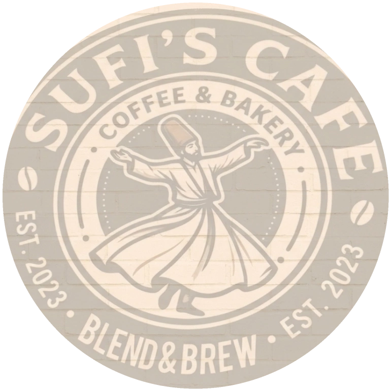

<div align="center">
  
</div>

<h1 align="center">☕ Sufis Cafe / Sufis De Cafe (Kheda)</h1>

<p align="center">
  <b>A highly immersive, performance-optimized cafe website powered by Three.js WebGL rendering.</b>
</p>

---

## 📍 About Sufis Cafe

Located right alongside or in the immediate vicinity of **Dawat Restaurant** on the Kheda highway, **Sufis Cafe (Sufis De Cafe)** offers a warm, refreshing stop for highway travellers, families, and food enthusiasts.

- **Address:** Next to Dawat Restaurant, Nearby Coca-Cola Plant, Opposite Sumar Logistics, Kheda-Ahmedabad Highway, Kajipura, Kheda, Gujarat - 387120
- **Phone Number:** [+91 83208 12121](tel:+918320812121)
- **Instagram Profile:** [@dawatrestaurant_](https://www.instagram.com/dawatrestaurant_)

---

## Technical Highlights

- **3D WebGL Rendering:** Features a custom `.glb` 3D model managed by `Three.js` and `OrbitControls`, responding dynamically to screen size and user scrolling.
- **Micro-Optimized Performance:** Uses **Google DRACO** mesh compression, native Intersection Observers to pause GPU calculations off-screen, and strict PixelRatio capping to deliver seamless frames on modern mobile devices.
- **Glassmorphism UI:** Complete responsive design featuring modern CSS frosted-glass aesthetics built entirely without bloated CSS frameworks—pure vanilla precision.
- **Technical SEO:** Fully structured metadata, `robots.txt`, and automated `schema.org/CafeOrCoffeeShop` JSON-LD injections ensuring the cafe explicitly dominates the local Google Search ecosystem.

## Tech Stack

- **HTML5** & **Vanilla CSS3**
- **JavaScript (ES Modules)**
- **Three.js** (WebGL 3D Engine)
- **Intersection Observer API**

## Local Setup

1. Clone or open the repository.
2. Run a local development server:
   ```bash
   python serve.py
   ```
3. Open the browser to `http://localhost:3000`

---
*Built with ☕ for Sufis Cafe.*

